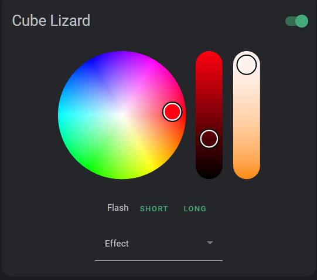

# Fancy Light Card by [@dancing-lizard](https://www.github.com/dancing-lizard)

Home Assistant custom light card using iro.js for color pickers



Features:

-   Color, brightness, temperature and effect selection based on device capabilities
-   Flashing
-   Mobile friendly

[![GitHub Release][releases-shield]][releases]
[![License][license-shield]](LICENSE.md)
[](https://github.com/custom-components/hacs)

## Options

| Name   | Type   | Requirement  | Description               | Default                       |
| ------ | ------ | ------------ | ------------------------- | ----------------------------- |
| type   | string | **Required** | `custom:fancy-light-card` |                               |
| entity | string | **Required** | Home Assistant entity ID. |                               |
| name   | string | **Optional** | Card name                 | `Friendly name of the entity` |

[license-shield]: https://img.shields.io/github/license/dancing-lizard/fancy-light-card.svg?style=for-the-badge
[releases-shield]: https://img.shields.io/github/release/dancing-lizard/fancy-light-card.svg?style=for-the-badge
[releases]: https://github.com/dancing-lizard/fancy-light-card/releases

## Adding to Home Assistant

```yaml
resources:
    - url: /community_plugin/fancy-light-card/fancy-light-card.js
      type: module
```
